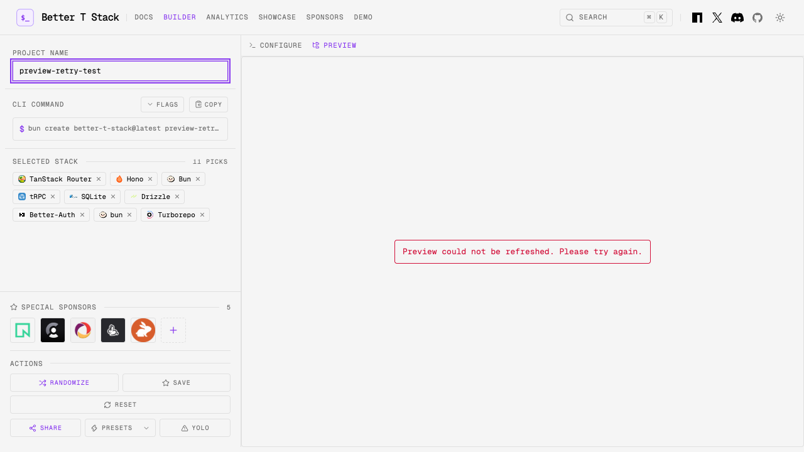

# Dependency baseline — September 2026

Workspace dependencies, generated package manifests, the generator's dependency map, addon runners, and GitHub Actions were checked against their upstream releases on 6 September 2026. The workspace lockfile was refreshed. `bun outdated --recursive --no-cache` now reports only TypeScript, which remains on the latest compatible compiler API release.

Keep these groups coordinated when updating the baseline:

| Group            | Selected baseline                                                | Compatibility constraint                                                                                                                                                                                             |
| ---------------- | ---------------------------------------------------------------- | -------------------------------------------------------------------------------------------------------------------------------------------------------------------------------------------------------------------- |
| TypeScript       | 6.0.3                                                            | TypeScript 7 replaces the JavaScript compiler API. The repository imports that API, and the current `svelte-check` peer range excludes 7. Upgrading the compiler requires migrating its consumers together.          |
| Solid            | Solid/web rc.6, router next.21, Vite plugin next.39              | Exact prerelease pins avoid npm dist-tag differences across Bun, npm and pnpm. Update the pnpm release-age exemptions alongside the manifest.                                                                        |
| Solid Query      | solid-query/devtools 6.0.0-rc.3 with query-core 5.101.4          | The Solid RC depends on this exact core release. A second Query Core version gives oRPC and Solid Query incompatible private class types.                                                                            |
| Expo             | SDK 57.0.20, React Native 0.86.3, React 19.2.3                   | Native templates follow Expo's `bundledNativeModules.json`, including gesture handler, reanimated and worklets. Keep Babel 7 for Expo's Babel 7 presets. Independently newest native packages target different SDKs. |
| Better Auth      | 1.7.3 normally; 1.6.17 with Convex                               | `@convex-dev/better-auth@0.12.5` requires Better Auth below 1.7; the existing 1.6.17 pin also avoids the adapter's AuthClient type regression.                                                                       |
| Polar            | SDK ^0.47.0                                                      | Required by the peer range of `@polar-sh/better-auth@1.8.4`.                                                                                                                                                         |
| Prisma           | CLI, client and adapters ^7.10.0                                 | Keep the family on the same stable release. The CLI's `latest` tag currently points to an 8.0 release candidate while the client remains on 7.                                                                       |
| Alchemy / Effect | Alchemy and frontend frameworks beta.76; Effect/platforms rc.112 | Keep the tested prerelease family together. Effect's stable dist-tag belongs to the older major API.                                                                                                                 |
| Visx             | 4.0.1-alpha.0                                                    | The existing selected prerelease is newer than the stable 4.0.0 dist-tag.                                                                                                                                            |

The repository uses Node 24 LTS and Bun 1.4.2. Docker templates retain supported major/LTS image channels, which receive patch updates through their tags. Database-major migrations are separate from package patch refreshes.

Upstream references: [TypeScript 7 package metadata](https://registry.npmjs.org/typescript/7.0.2), [Svelte Check metadata](https://registry.npmjs.org/svelte-check/4.7.6), [Solid Query RC metadata](https://registry.npmjs.org/@tanstack%2Fsolid-query/6.0.0-rc.3), [Expo SDK compatibility](https://docs.expo.dev/versions/latest/), [Convex Better Auth metadata](https://registry.npmjs.org/@convex-dev%2Fbetter-auth/0.12.5), [Convex adapter regression](https://github.com/get-convex/better-auth/issues/420), [Polar integration metadata](https://registry.npmjs.org/@polar-sh%2Fbetter-auth/1.8.4).

## Verification tiers

The Default Suite includes focused regressions for adding addons through relative and renamed directories, desktop scripts without a task runner, and PWA registration and launch URLs. PR CI additionally runs source type checks, website/shared-package tests, Matrix Smoke, and representative Curated Build Set jobs. The complete local command remains `bun run test:complete`; the Exhaustive Matrix remains opt-in.

Generated build samples clean up each project after its assertions, including failed samples, to avoid retaining all installed workspaces until suite teardown. On machines with limited free disk space, run sample groups separately with `BTS_BUILD_SAMPLE_FILTER` and an isolated package-manager cache.

The website preview refresh regression was checked by loading a preview, intercepting the next request with HTTP 500, changing the Project Configuration, then allowing a successful refresh. The error replaces the obsolete preview; a later success restores the new project's file tree.

